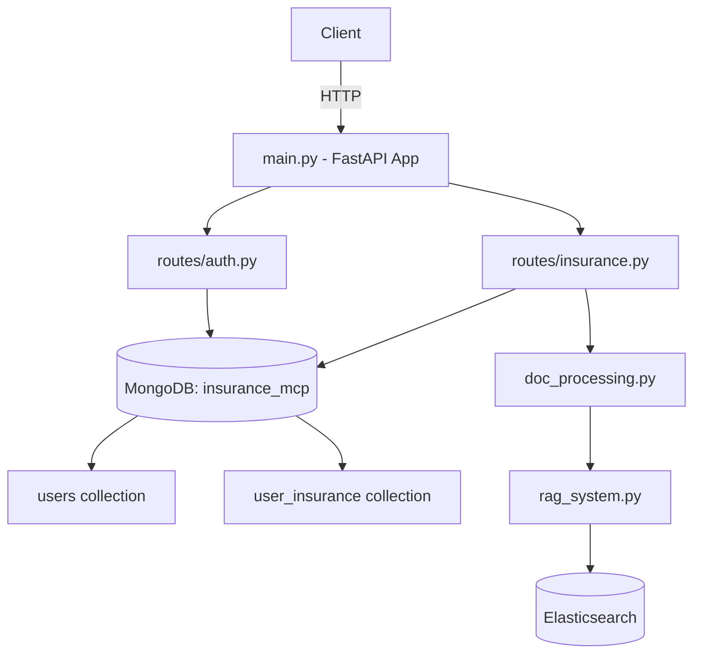
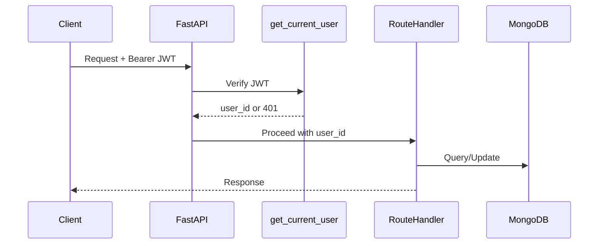
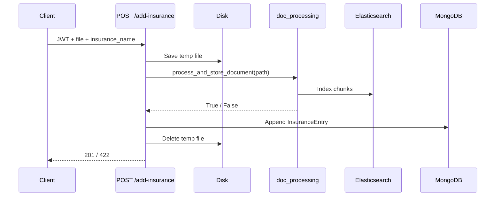

# Design Document: Insurance API Backend

## Overview

A FastAPI backend that provides user authentication and insurance record management for an insurance platform. The API connects to MongoDB (`insurance_mcp`) for persistent storage of users and insurance records, and integrates with the existing RAG pipeline (`doc_processing.py` + `rag_system.py`) to extract, chunk, and index uploaded insurance documents into Elasticsearch for vector search.

The system is organized into three layers:
- **Routes**: HTTP endpoint handlers (`routes/auth.py`, `routes/insurance.py`)
- **Models**: Pydantic request/response schemas (`models/schemas.py`)
- **Database**: MongoDB connection and collection accessors (`database/db.py`)

Authentication is stateless via JWT. All protected endpoints verify the token before processing.

---

## Architecture



**Request flow for protected endpoints:**



**Document upload flow:**



---

## Components and Interfaces

### `main.py`

Entry point. Loads `.env`, creates the FastAPI app, and includes routers.

```python
app = FastAPI()
app.include_router(auth_router, prefix="")
app.include_router(insurance_router, prefix="")
```

Raises `RuntimeError` if `MONGO_URI` is absent from environment at startup.

---

### `database/db.py`

Manages a single `MongoClient` instance shared across the application.

```python
def get_db() -> Database: ...          # returns insurance_mcp database
def get_users_collection() -> Collection: ...
def get_insurance_collection() -> Collection: ...
```

Raises on connection failure at import time so the app fails fast.

---

### `models/schemas.py`

All Pydantic v2 models used for request validation and response serialization.

| Model | Fields |
|---|---|
| `UserSignup` | `username: str`, `email: str`, `password: str` |
| `UserSignin` | `email: str`, `password: str` |
| `InsuranceEntry` | `insurance_name: str`, `insurance_date: str` |
| `InsuranceRecord` | `userid: str`, `insurance_obtained: list[InsuranceEntry]` |

---

### `routes/auth.py`

Handles `/signup` and `/signin`.

```python
router = APIRouter()

@router.post("/signup", status_code=201)
async def signup(data: UserSignup) -> dict: ...

@router.post("/signin", status_code=200)
async def signin(data: UserSignin) -> dict: ...
```

Dependency: `get_users_collection()`

---

### `routes/insurance.py`

Handles `/insurance-obtained` (GET + POST) and `/add-insurance` (POST). All routes depend on `get_current_user`.

```python
router = APIRouter()

@router.get("/insurance-obtained", status_code=200)
async def get_insurance(user_id: str = Depends(get_current_user)) -> dict: ...

@router.post("/insurance-obtained", status_code=201)
async def add_insurance_entry(entry: InsuranceEntry, user_id: str = Depends(get_current_user)) -> dict: ...

@router.post("/add-insurance", status_code=201)
async def upload_insurance(
    insurance_name: str = Form(...),
    file: UploadFile = File(...),
    user_id: str = Depends(get_current_user)
) -> dict: ...
```

---

### `auth/dependencies.py` (or inline in `routes/auth.py`)

JWT utility functions:

```python
def create_access_token(data: dict) -> str: ...
def get_current_user(token: str = Depends(oauth2_scheme)) -> str: ...
    # raises HTTP 401 if token is missing or invalid
```

Uses `python-jose` for JWT encoding/decoding. Secret key loaded from `JWT_SECRET` env var.

---

## Data Models

### MongoDB: `users` collection

```json
{
  "_id": ObjectId,
  "username": "string",
  "email": "string (unique index)",
  "password": "string (bcrypt hash)"
}
```

### MongoDB: `user_insurance` collection

```json
{
  "_id": ObjectId,
  "userid": "string (user _id as str)",
  "insurance_obtained": [
    {
      "insurance_name": "string",
      "insurance_date": "string (ISO date)"
    }
  ]
}
```

### JWT Payload

```json
{
  "sub": "user_id_string",
  "exp": 1234567890
}
```

### Environment Variables

| Variable | Purpose |
|---|---|
| `MONGO_URI` | MongoDB Atlas connection string |
| `JWT_SECRET` | Secret key for signing JWT tokens |
| `JWT_ALGORITHM` | Algorithm (default: `HS256`) |
| `ACCESS_TOKEN_EXPIRE_MINUTES` | Token TTL (default: `60`) |

---

## Correctness Properties

*A property is a characteristic or behavior that should hold true across all valid executions of a system — essentially, a formal statement about what the system should do. Properties serve as the bridge between human-readable specifications and machine-verifiable correctness guarantees.*

### Property 1: Signup creates a retrievable user

*For any* valid `(username, email, password)` triple, calling `POST /signup` should return HTTP 201 with the new user's `id` and `username`, and the user should subsequently exist in the `users` collection.

**Validates: Requirements 3.1, 3.4**

---

### Property 2: Passwords are never stored as plaintext

*For any* password string submitted during signup, the value stored in the `users` collection should never equal the original plaintext, and `bcrypt.checkpw(plaintext, stored)` should return `True`.

**Validates: Requirements 3.2**

---

### Property 3: Duplicate email signup is rejected

*For any* email address already present in the `users` collection, a subsequent `POST /signup` with that same email should return HTTP 400.

**Validates: Requirements 3.3**

---

### Property 4: Valid credentials produce a verifiable JWT

*For any* registered user, calling `POST /signin` with the correct email and password should return HTTP 200 with a JWT that decodes successfully using the server's secret key and contains the correct `sub` (user id).

**Validates: Requirements 4.1, 4.2, 4.5**

---

### Property 5: Invalid credentials are rejected with 401

*For any* email not present in the `users` collection, or *for any* registered user with an incorrect password, `POST /signin` should return HTTP 401.

**Validates: Requirements 4.3, 4.4**

---

### Property 6: Insurance entries round-trip correctly

*For any* authenticated user and any sequence of `InsuranceEntry` values posted to `POST /insurance-obtained`, a subsequent `GET /insurance-obtained` should return a list containing all those entries in the order they were added.

**Validates: Requirements 5.1, 5.2, 6.1, 6.2, 6.3**

---

### Property 7: Protected endpoints reject missing or invalid JWTs

*For any* request to `GET /insurance-obtained`, `POST /insurance-obtained`, or `POST /add-insurance` that carries no `Authorization` header or a malformed/expired JWT, the API should return HTTP 401.

**Validates: Requirements 5.3, 6.4, 7.7**

---

### Property 8: Successful document upload appends an insurance entry

*For any* authenticated user and any supported file (`.pdf`, `.docx`, `.pptx`, `.txt`) where `Doc_Processor` returns `True`, calling `POST /add-insurance` should append an `InsuranceEntry` with the provided `insurance_name` and today's date to the user's record, and the temporary file should be deleted from disk.

**Validates: Requirements 7.3, 7.5**

---

### Property 9: Unsupported file types are rejected before processing

*For any* file whose extension is not in `{.pdf, .docx, .pptx, .txt}`, `POST /add-insurance` should return HTTP 415 and `Doc_Processor` should never be called.

**Validates: Requirements 7.6**

---

### Property 10: Missing required fields return HTTP 422

*For any* endpoint and *for any* request body missing one or more required fields, the API should return HTTP 422 with a validation error that identifies the missing field(s).

**Validates: Requirements 8.1, 8.2, 8.3, 8.4, 8.5**

---

## Error Handling

| Scenario | HTTP Status | Detail |
|---|---|---|
| Missing `MONGO_URI` at startup | App exits | `RuntimeError` raised before server starts |
| MongoDB connection failure | App exits | Exception propagated at startup |
| Duplicate email on signup | 400 | `"Email already registered"` |
| Email not found on signin | 401 | `"Invalid credentials"` |
| Wrong password on signin | 401 | `"Invalid credentials"` (same message to avoid user enumeration) |
| Missing/invalid JWT on protected route | 401 | `"Could not validate credentials"` |
| Unsupported file extension | 415 | `"Unsupported file type: {ext}"` |
| `Doc_Processor` returns `False` | 422 | `"Document could not be processed"` |
| Missing required request field | 422 | FastAPI/Pydantic default validation error |

**Temp file cleanup**: The `POST /add-insurance` handler wraps `Doc_Processor` in a `try/finally` block to guarantee the temp file is deleted even if an exception is raised.

**JWT errors**: `python-jose` `JWTError` is caught and re-raised as `HTTPException(401)`.

---

## Testing Strategy

### Dual Testing Approach

Both unit tests and property-based tests are required. They are complementary:
- Unit tests cover specific examples, integration points, and error conditions.
- Property-based tests verify universal correctness across randomized inputs.

### Unit Tests

Focus areas:
- Startup error when `MONGO_URI` is absent (Requirement 1.4)
- Database name and collection names are correct (Requirements 2.2, 2.3)
- JWT is signed with the correct secret (Requirement 4.5)
- `Doc_Processor` is called with the correct file path (Requirement 7.2)
- `Doc_Processor` returning `False` yields HTTP 422 (Requirement 7.4)
- Pydantic model instantiation with missing fields raises `ValidationError` (Requirements 8.1–8.4)

Use `pytest` with `mongomock` or `motor` test client for MongoDB, and `unittest.mock.patch` for `doc_processing.process_and_store_document`.

### Property-Based Tests

Use **Hypothesis** (Python) with a minimum of **100 iterations** per property.

Each test must include a comment referencing its design property using the tag format:
`# Feature: insurance-api-backend, Property {N}: {property_text}`

| Property | Test Description |
|---|---|
| Property 1 | Generate random `(username, email, password)` → signup → assert 201 + user in DB |
| Property 2 | Generate random passwords → signup → assert stored != plaintext, bcrypt verifies |
| Property 3 | Generate random email → signup twice → assert second returns 400 |
| Property 4 | Generate random user → signup → signin with correct creds → assert 200 + valid JWT |
| Property 5 | Generate random non-existent email or wrong password → signin → assert 401 |
| Property 6 | Generate random user + list of InsuranceEntry → POST each → GET → assert round-trip |
| Property 7 | Generate random tokens (empty, malformed, expired) → hit each protected endpoint → assert 401 |
| Property 8 | Generate random user + supported file → mock Doc_Processor=True → POST /add-insurance → assert entry added + temp file deleted |
| Property 9 | Generate random unsupported extensions → POST /add-insurance → assert 415 + Doc_Processor not called |
| Property 10 | Generate requests with random missing fields → assert 422 with field name in error |

### Test Configuration

```python
# conftest.py
from hypothesis import settings
settings.register_profile("ci", max_examples=100)
settings.load_profile("ci")
```

Use FastAPI's `TestClient` (from `httpx`) for all HTTP-level tests. Mock MongoDB with `mongomock` to avoid requiring a live Atlas connection in tests.
