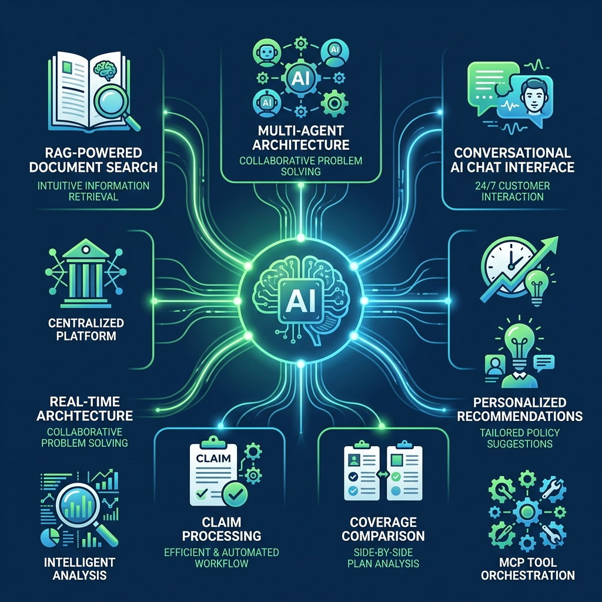
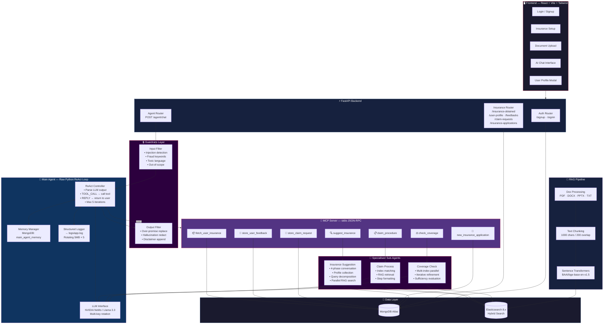
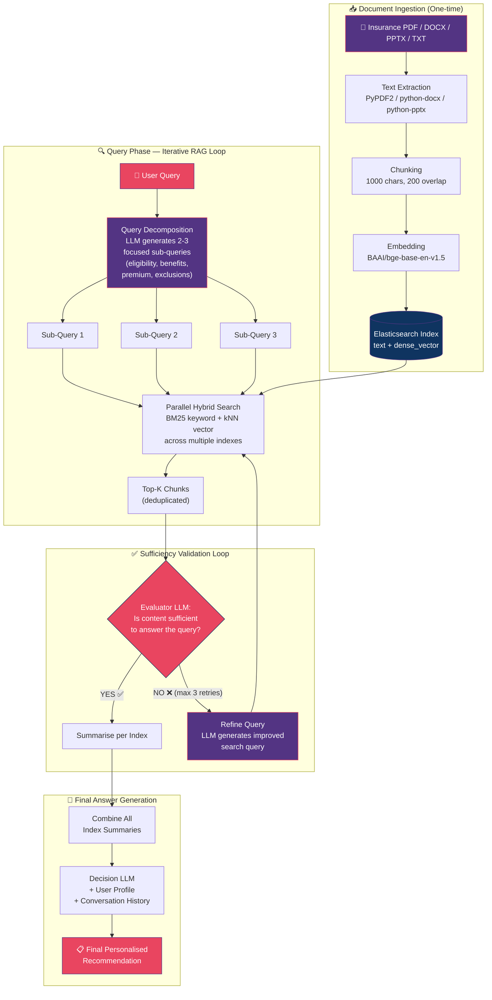
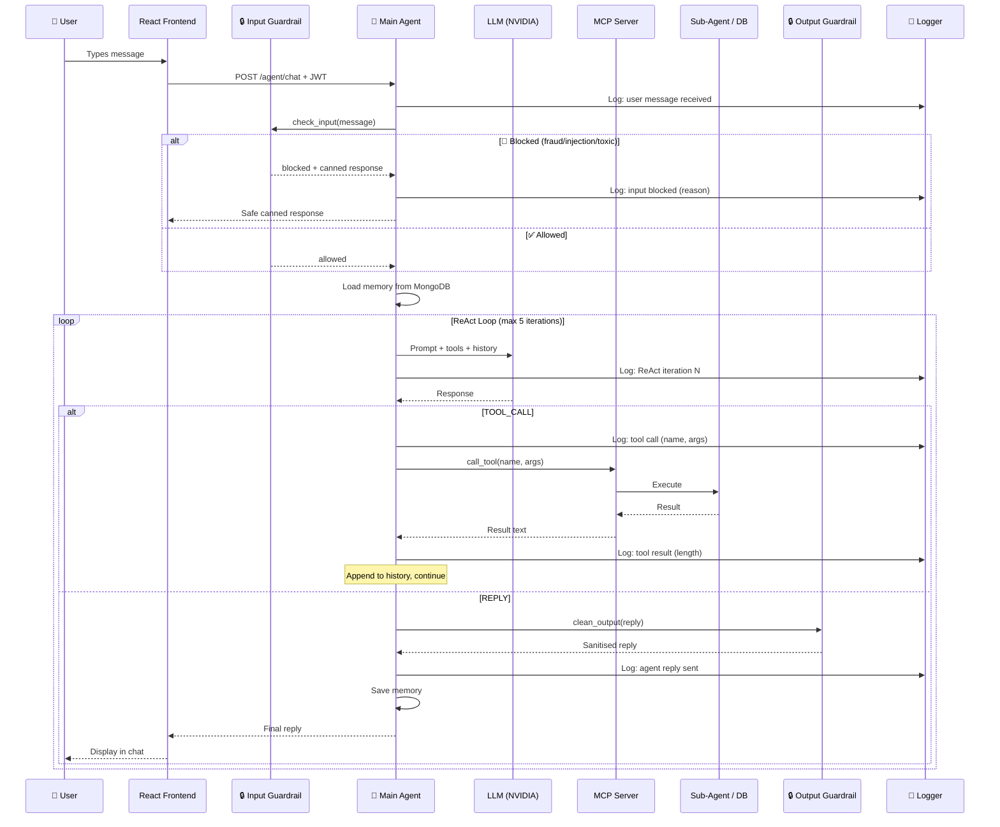

<div align="center">

# 🛡️ Insurance Hub

**A Raw Python Autonomous AI Agent — No LangChain, No LangGraph, No Frameworks**

Built from scratch using pure Python with MCP protocol, custom RAG pipeline, and multi-agent orchestration.

[](#)
[](#)
[](#)
[](#)
[](#)
[](#)

### 🎬 [Watch the Demo Video →](https://youtu.be/HTbAmvw2KjQ)

</div>

---

## 📊 Problem Statement

<p align="center">
  
</p>

Managing insurance is **broken** for most people today:

| # | Problem |
|:-:|---------|
| 1 | Many individuals hold **multiple insurance policies** (health, life, motor) from different providers — making it hard to manage in one place |
| 2 | When a real-life situation occurs (hospitalization, accident), users face **confusion deciding which policy** is most suitable |
| 3 | **No centralized system** exists to compare multiple owned policies and recommend the best option based on the situation |
| 4 | Users lack proper knowledge of **insurance terms, coverage details, and claim conditions** — leading to poor decisions |
| 5 | Insurance information is **fragmented across companies and platforms**, making it hard to access and compare |
| 6 | Reliance on **manual customer support** increases costs and delays response time |
| 7 | No system provides **real-time, personalized recommendations** based on user profile and current situation |
| 8 | No **intelligent feedback mechanism** that learns from interactions to improve suggestions over time |
| 9 | Users are **unable to maximize benefits** of policies they already own |
| 10 | There is a need for an **intelligent, centralized insurance hub** that can analyze policies, understand queries conversationally, and provide accurate recommendations |

---

## 💡 Our Solution — How Insurance Hub Solves These Problems

<p align="center">
  
</p>

Insurance Hub is a **raw Python autonomous AI agent** (no LangChain, no frameworks) that solves each problem:

| Problem | How We Solve It |
|---------|----------------|
| Multiple scattered policies | **Centralized dashboard** — upload all policies to one platform, view them in user profile |
| Confusion during emergencies | **Coverage Check Agent** — compares all your policies in parallel and recommends the best one for your situation |
| No comparison system | **Multi-index RAG search** — searches across all uploaded policy documents simultaneously |
| Lack of insurance knowledge | **Conversational AI** — explains terms, coverage, and claim procedures in plain language |
| Fragmented information | **Elasticsearch hybrid search** — all policy documents indexed and searchable with BM25 + vector search |
| Manual support delays | **Autonomous agent** — instant responses 24/7, handles suggestions, claims, coverage checks autonomously |
| No personalization | **Profile-aware recommendations** — collects user profile (age, income, dependents) and tailors suggestions |
| No learning mechanism | **Persistent MongoDB memory** — remembers past conversations and builds on previous interactions |
| Underutilized benefits | **Proactive coverage analysis** — suggests which policy to claim based on your specific situation |
| Need for intelligent hub | **This is it** — MCP-orchestrated multi-agent system with RAG, guardrails, and structured logging |

---

## 🏗️ System Architecture

> **Note:** This is a **raw Python agent** — all agent logic, ReAct loops, tool orchestration, memory management, and RAG pipelines are implemented from scratch without any AI agent framework.



---

## 🔄 Advanced RAG Pipeline — With Iterative Refinement & Query Decomposition

This is **not a simple retrieve-and-answer pipeline**. Our RAG system uses **query decomposition**, **iterative refinement loops**, and **sufficiency validation** to ensure high-quality answers:



### RAG Techniques Used

| Technique | Where | Purpose |
|-----------|-------|---------|
| **Query Decomposition** | `insurance_suggestion_agent` | Breaks user intent into 2-3 focused sub-queries (eligibility, benefits, cost, exclusions) |
| **Parallel Multi-Index Search** | `coverage_check_agent`, `insurance_suggestion_agent` | Searches multiple insurance indexes concurrently via `ThreadPoolExecutor` |
| **Hybrid Search (BM25 + kNN)** | `rag_system.py` | Combines keyword matching with semantic vector similarity for better relevance |
| **Iterative Query Refinement** | `coverage_check_agent` | If retrieved content is insufficient, LLM generates a refined query (up to 3 retries) |
| **Sufficiency Evaluation** | `coverage_check_agent` | Evaluator LLM decides if results are good enough before proceeding |
| **Per-Index Summarisation** | `coverage_check_agent` | Each index's results are summarised before final decision |
| **Profile-Aware Context** | `insurance_suggestion_agent` | User profile (age, income, dependents) is injected into the final LLM context |

---

## 🔄 Agent Decision Flow (ReAct Loop)



---

## 🔒 Guardrails System

The agent has **keyword-based input and output safety filters** — a fast, deterministic first layer of protection:

### Input Guardrails (block before LLM)

| Category | Action | Examples |
|----------|--------|---------|
| **Prompt Injection** | Block + safe reply | "ignore instructions", "jailbreak", "bypass rules" |
| **Fraud Intent** | Block + safe reply | "fake claim", "insurance fraud", "false documents" |
| **Toxic Language** | Block + safe reply | "stupid bot", "shut up", "useless bot" |
| **Out-of-Scope** | Block + safe reply | "movie recommendation", "hack wifi", "crypto trading" |

### Output Guardrails (sanitise after LLM)

| Layer | Action | Examples |
|-------|--------|---------|
| **Over-Promising** | Replace phrase | "guaranteed return" → "potential return" |
| **Hallucinated Offers** | Redact | "secret insurance" → "[information not verified]" |
| **Sensitive Claims** | Append disclaimer | Detects "legal advice" → adds ⚠️ disclaimer |

---

## 📝 Structured Logging

All actions are logged to both **console** and **rotating log file** (`logs/app.log`, 5 MB × 5 backups):

```
2026-04-29 01:18:33 │ INFO     │ main_agent │ chat_with_agent:121 │ Tool call | user=abc123 | tool=suggest_insurance | args={...}
2026-04-29 01:18:34 │ INFO     │ main_agent │ chat_with_agent:127 │ Tool result | tool=suggest_insurance | length=342 chars
2026-04-29 01:18:35 │ WARNING  │ guardrails.input_filter │ check_input:86 │ Input BLOCKED | reason=injection | keyword='ignore instructions'
```

| Event | Level | Module |
|-------|-------|--------|
| User message received | `INFO` | `main_agent` |
| Guardrail block | `WARNING` | `guardrails.input_filter` |
| Output sanitised | `INFO` | `guardrails.output_filter` |
| Tool call (name + args) | `INFO` | `main_agent` |
| Tool result | `INFO` / `DEBUG` | `main_agent` |
| RAG search iteration | `INFO` | `agents.*` |
| Errors (with traceback) | `ERROR` | all modules |

---

## 🤖 MCP Tools Reference

| Tool | Parameters | Purpose |
|------|-----------|---------|
| `suggest_insurance` | `user_message` | Multi-turn recommendation with profile collection & parallel RAG |
| `claim_procedure` | `user_message` | Step-by-step claim guide via RAG search |
| `check_coverage` | `index_names`, `user_query` | Compare coverage across policies with iterative refinement |
| `fetch_user_insurance` | — | Retrieve all user's policies |
| `store_user_feedback` | `rating`, `comment` | Record feedback (1-5 rating) |
| `store_claim_request` | `insurance_name`, `claim_description`, `claim_amount` | Submit claim request |
| `new_insurance_application` | `insurance_type`, `applicant_age`, `reason` | Apply for new policy |

> **Note:** `user_id` is auto-injected by the main agent — the LLM never handles it.

---

## 📂 Project Structure

```
ragworksProject/
├── main.py                      # FastAPI app entry point
├── main_agent.py                # 🧠 Core ReAct agent (raw Python, no frameworks)
├── mcp_server.py                # 🔧 MCP tool server (stdio transport)
│
├── rag/                         # 📄 RAG Pipeline
│   ├── rag_system.py            #   Elasticsearch hybrid search (BM25 + kNN)
│   ├── doc_processing.py        #   Text extraction + chunking
│   └── doc_uploader.py          #   File/directory upload utilities
│
├── agents/                      # 🤖 Specialised sub-agents
│   ├── insurance_suggestion_agent.py
│   ├── claim_process.py
│   ├── coverage_check_agent.py
│   ├── user_details.py
│   └── prompts/                 #   Centralised prompt templates
│       └── prompts.py
│
├── guardrails/                  # 🔒 Safety filters
│   ├── keywords.py              #   All keyword lists
│   ├── input_filter.py          #   Pre-LLM input checking
│   └── output_filter.py         #   Post-LLM output sanitisation
│
├── services/
│   ├── llms.py                  # NVIDIA LLM client + key rotation
│   └── logger.py                # Centralized logging config
│
├── routes/
│   ├── auth.py                  # Signup / Signin (JWT)
│   └── insurance.py             # Insurance CRUD + memory + profile
│
├── auth/
│   └── dependencies.py          # JWT token creation & validation
│
├── database/
│   └── db.py                    # MongoDB collection accessors
│
├── models/
│   └── schemas.py               # Pydantic models
│
├── logs/                        # 📝 Auto-generated log files
│   └── app.log
│
├── frontEnd/                    # 🖥️ React + TypeScript + Vite + Tailwind
│   └── src/
│       ├── components/          #   Login, Signup, Setup, AddInsurance, Chat
│       └── services/api.ts      #   Axios + JWT interceptor
│
├── tests/
│   └── test_main_agent.py       # 18 unit tests + conversation replay
│
├── assets/                      # README images
├── requirements.txt
└── .env                         # Environment variables (not committed)
```

---

## ⚙️ Setup & Installation

### Prerequisites

| Dependency | Version | Purpose |
|------------|---------|---------|
| Python | 3.12+ | Backend |
| Node.js | 18+ | Frontend |
| MongoDB Atlas | — | Data storage |
| Elasticsearch | 8.x | RAG search |
| NVIDIA API Key(s) | — | LLM inference |

### 1. Clone & Install

```bash
git clone https://github.com/Manojkumar211205/insurance_hub.git
cd insurance_hub

# Backend
python -m venv myenv
myenv\Scripts\activate
pip install -r requirements.txt

# Frontend
cd frontEnd
npm install
cd ..
```

### 2. Configure `.env`

```env
MONGO_URI=mongodb+srv://<user>:<pass>@<cluster>.mongodb.net/
JWT_SECRET=your-jwt-secret
JWT_ALGORITHM=HS256
ACCESS_TOKEN_EXPIRE_MINUTES=60
nvidiaKey1=nvapi-xxxxxxxxxxxx
nvidiaKey2=nvapi-xxxxxxxxxxxx
```

### 3. Start Elasticsearch

```bash
docker run -d --name elasticsearch \
  -p 9200:9200 \
  -e "discovery.type=single-node" \
  -e "xpack.security.enabled=false" \
  docker.elastic.co/elasticsearch/elasticsearch:8.12.0
```

### 4. Upload Insurance Documents

```python
from rag.doc_uploader import upload_file
upload_file("Health Insurance Research bajaj.pdf", "bajaj_health_insurance")
```

### 5. Run

```bash
# Terminal 1 — Backend
python -m uvicorn main:app --reload

# Terminal 2 — Frontend
cd frontEnd
npm run dev
```

| Service | URL |
|---------|-----|
| Backend | `http://127.0.0.1:8000` |
| Frontend | `http://localhost:5173` |
| API Docs | `http://127.0.0.1:8000/docs` |

---

## 🔑 API Endpoints

### Authentication

| Method | Endpoint | Body |
|--------|----------|------|
| POST | `/signup` | `{username, email, password}` |
| POST | `/signin` | `{email, password}` → JWT token |

### Agent

| Method | Endpoint | Auth | Body |
|--------|----------|------|------|
| POST | `/agent/chat` | 🔒 | `{user_message}` |

### Insurance Management

| Method | Endpoint | Auth | Description |
|--------|----------|------|-------------|
| GET | `/insurance-obtained` | 🔒 | List user's policies |
| POST | `/insurance-obtained` | 🔒 | Add entry manually |
| POST | `/add-insurance` | 🔒 | Upload & process document |
| GET | `/insurance-available` | — | List all products |
| GET | `/user-profile` | 🔒 | User details + insurances |
| GET | `/feedbacks` | 🔒 | User feedbacks |
| GET | `/claim-requests` | 🔒 | User claims |
| GET | `/insurance-applications` | 🔒 | User applications |
| DELETE | `/clear-memory` | 🔒 | Clear conversation memory |

---

## 🧪 Testing

```bash
pip install pytest pytest-asyncio
python -m pytest tests/test_main_agent.py -v
```

18 unit tests covering tool calls, memory persistence, error handling, guardrails, and a full 9-turn conversation replay.

---

## 💡 Key Design Decisions

| Decision | Rationale |
|----------|-----------|
| **Raw Python agent (no LangChain)** | Full control over agent loop, memory, tool calls — no framework abstractions or overhead |
| **MCP protocol** | Decouples tools from agent; tools can be updated without touching agent logic |
| **ReAct loop (5 iterations)** | Multi-step reasoning with bounded execution |
| **Iterative RAG refinement** | Up to 3 retries with refined queries ensures high-quality retrieval |
| **Query decomposition** | Single user query → 2-3 focused sub-queries for better coverage |
| **Keyword guardrails** | Fast, deterministic safety layer before/after LLM |
| **Centralized prompts** | All prompts in `agents/prompts/prompts.py` for easy tuning |
| **Structured logging** | Every action logged to rotating file for debugging & audit |
| **Parallel RAG search** | `ThreadPoolExecutor` for concurrent multi-index search |
| **Auto user_id injection** | Security — LLM never sees or handles user IDs |

---

## 📊 MongoDB Collections

| Collection | Purpose |
|------------|---------|
| `users` | User accounts |
| `user_insurance` | Purchased policies |
| `insurance_available` | Product catalog |
| `main_agent_memory` | Main agent history |
| `suggestion_memory` | Suggestion agent sessions |
| `coverage_check_memory` | Coverage agent memory |
| `user_feedbacks` | Feedback records |
| `user_claim_requests` | Claim requests |
| `insurance_applications` | New applications |

---

## 📜 License

This project is for educational and demonstration purposes.

---

<div align="center">
  <sub>Built from scratch with ❤️ — Raw Python Agent + React + FastAPI + MCP + Elasticsearch + NVIDIA LLMs</sub>
</div>
