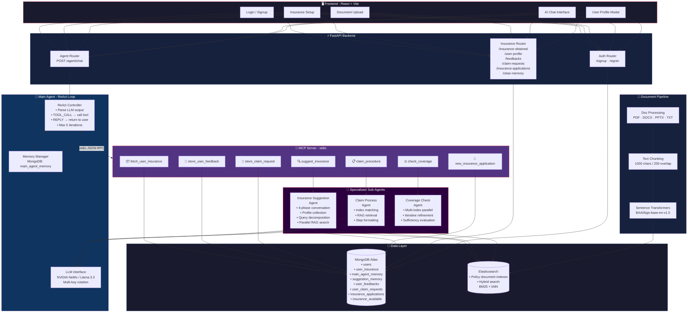
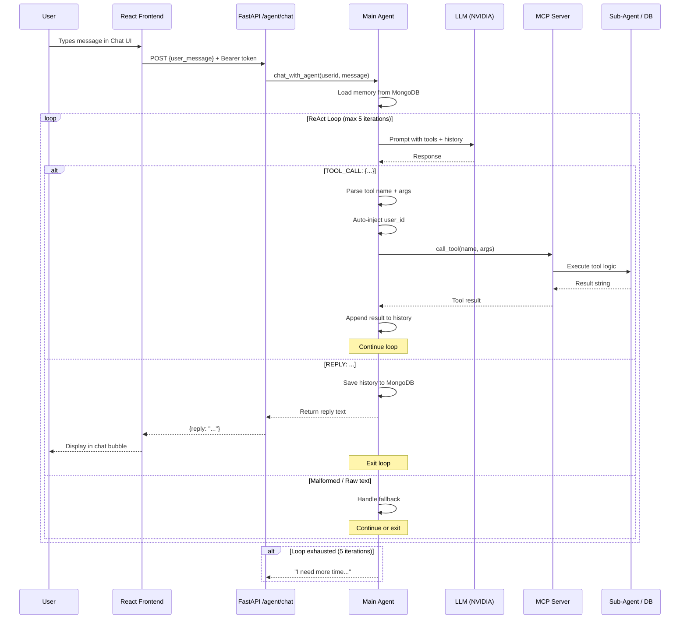
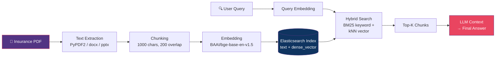

<div align="center">

# 🛡️ Insurance Hub

**An Autonomous AI Insurance Assistant powered by Model Context Protocol, RAG, and Multi-Agent Architecture**

[](#)
[](#)
[](#)
[](#)
[](#)
[](#)
[](#)

</div>

---

## 📖 Overview

Insurance Hub is a full-stack autonomous AI assistant that helps users **discover, compare, and manage insurance policies** through natural conversation. It combines:

- **Model Context Protocol (MCP)** for structured tool orchestration
- **Retrieval-Augmented Generation (RAG)** with Elasticsearch hybrid search for policy-accurate answers
- **Multi-agent architecture** where specialised sub-agents handle suggestions, claims, and coverage analysis
- **Persistent memory** via MongoDB for multi-turn conversation continuity
- **React + TypeScript frontend** with a polished chat interface, user profiles, and insurance management

The system can suggest insurance plans, explain claim procedures, compare coverage across policies, file claims, collect feedback, and process new applications — all autonomously.

---

## 🏗️ System Architecture



---

## 🔄 Agent Decision Flow

This is the ReAct (Reason + Act) loop that powers every user interaction:



---

## 🖥️ Frontend (React + TypeScript + Vite)

The frontend is a **single-page application** built with React 18, TypeScript, Vite, and Tailwind CSS. It provides a polished, responsive interface for interacting with the AI agent.

### Tech Stack

| Technology | Version | Purpose |
|---|---|---|
| React | 18.2 | UI framework |
| TypeScript | 5.x | Type safety |
| Vite | 4.x | Build tool & dev server |
| Tailwind CSS | 3.3 | Utility-first styling |
| React Router | 6.8 | Client-side routing |
| Axios | 1.4 | HTTP client with JWT interceptor |

### Pages & Components

| Route | Component | Description |
|---|---|---|
| `/login` | `Login.tsx` | Email + password sign-in form |
| `/signup` | `Signup.tsx` | New user registration |
| `/setup` | `Setup.tsx` | Select existing insurance policies from available companies (checkbox grid) |
| `/add-insurance` | `AddInsurance.tsx` | Upload insurance documents (PDF/DOCX/PPTX/TXT) for RAG indexing |
| `/chat` | `Chat.tsx` | Main AI chat interface with profile modal |

### Chat Interface Features

- **Real-time messaging** with user/agent avatars and timestamps
- **Typing indicator** with animated dots while the agent processes
- **Profile modal** — view user details, purchased insurances, feedbacks, claim requests, and applications (all fetched in parallel)
- **Memory reset** — clear all conversation history with one click
- **Glassmorphism design** — gradient header, backdrop blur, rounded chat bubbles
- **Protected routes** — all pages except login/signup require JWT authentication
- **Auto token injection** — Axios interceptor adds `Bearer` token to every request

### Frontend Structure

```
ragworks_frontEnd/
├── index.html                   # Entry point
├── package.json                 # Dependencies & scripts
├── vite.config.ts               # Vite configuration
├── tailwind.config.js           # Tailwind theme
├── tsconfig.json                # TypeScript config
│
└── src/
    ├── main.tsx                 # React mount + BrowserRouter
    ├── App.tsx                  # Route definitions + ProtectedRoute
    ├── index.css                # Tailwind imports
    │
    ├── components/
    │   ├── Login.tsx            # Sign-in form
    │   ├── Signup.tsx           # Registration form
    │   ├── Setup.tsx            # Insurance selection grid
    │   ├── AddInsurance.tsx     # Document upload form
    │   └── Chat.tsx             # AI chat + profile modal
    │
    └── services/
        └── api.ts               # Axios instance + all API calls
```

### Running the Frontend

```bash
cd ragworks_frontEnd
npm install
npm run dev
```

The dev server runs at `http://localhost:5173` and proxies API calls to `http://127.0.0.1:8000`.

---

## 🤖 MCP Tools Reference

The MCP server exposes **7 tools** that the main agent can call autonomously:

| Tool | Parameters | Purpose | Storage |
|---|---|---|---|
| `suggest_insurance` | `user_message` | Multi-turn insurance recommendation with profile collection & parallel RAG | `suggestion_memory` |
| `claim_procedure` | `user_message` | Step-by-step claim filing guide via RAG search on policy docs | — |
| `check_coverage` | `index_names`, `user_query` | Compare coverage across multiple insurance policies with iterative RAG refinement | `coverage_check_memory` |
| `fetch_user_insurance` | — | Retrieve all insurance policies owned by the user | reads `user_insurance` |
| `store_user_feedback` | `rating`, `comment` | Record user feedback (1-5 rating + comment) | `user_feedbacks` |
| `store_claim_request` | `insurance_name`, `claim_description`, `claim_amount` | Submit a formal insurance claim request | `user_claim_requests` |
| `new_insurance_application` | `insurance_type`, `applicant_age`, `reason` | Apply for a new insurance policy | `insurance_applications` |

> **Note:** `user_id` is auto-injected by the main agent for all tools — the LLM never sees or handles it.

---

## 📂 Full Project Structure

```
ragworksProject/
├── main.py                      # FastAPI app entry point
├── main_agent.py                # 🧠 Core ReAct agent with MCP client
├── mcp_server.py                # 🔧 MCP tool server (stdio transport)
├── rag_system.py                # Elasticsearch hybrid search (BM25 + kNN)
├── doc_processing.py            # Document ingestion pipeline
│
├── agents/                      # Specialised sub-agents
│   ├── insurance_suggestion_agent.py   # 4-phase suggestion flow
│   ├── claim_process.py                # Claim procedure retrieval
│   ├── coverage_check_agent.py         # Multi-index coverage analysis
│   └── user_details.py                 # User insurance data access
│
├── routes/                      # FastAPI routers
│   ├── auth.py                  # Signup / Signin (JWT)
│   └── insurance.py             # Insurance CRUD + memory + profile
│
├── auth/
│   └── dependencies.py          # JWT token creation & validation
│
├── database/
│   └── db.py                    # MongoDB collection accessors
│
├── models/
│   └── schemas.py               # Pydantic request/response models
│
├── services/
│   └── llms.py                  # NVIDIA LLM client with key rotation
│
├── tests/
│   ├── conftest.py              # Test fixtures
│   └── test_main_agent.py       # 18 unit tests + conversation replay
│
├── ragworks_frontEnd/           # 🖥️ React frontend (see above)
│
├── requirements.txt
└── .env                         # Environment variables (not committed)
```

---

## ⚙️ Setup & Installation

### Prerequisites

| Dependency | Version | Purpose |
|---|---|---|
| Python | 3.12+ | Backend runtime |
| Node.js | 18+ | Frontend build |
| MongoDB Atlas | — | User data, memory, applications |
| Elasticsearch | 8.x | RAG hybrid search engine |
| NVIDIA API Key(s) | — | LLM inference |

### 1. Clone & Install Backend

```bash
git clone https://github.com/Manojkumar211205/insurance_hub.git
cd insurance_hub
python -m venv myenv
myenv\Scripts\activate        # Windows
pip install -r requirements.txt
```

### 2. Install Frontend

```bash
cd ragworks_frontEnd
npm install
cd ..
```

### 3. Configure Environment

Create a `.env` file in the project root:

```env
MONGO_URI=mongodb+srv://<user>:<pass>@<cluster>.mongodb.net/
JWT_SECRET=your-jwt-secret
JWT_ALGORITHM=HS256
ACCESS_TOKEN_EXPIRE_MINUTES=60

# NVIDIA API keys (supports multiple for rate-limit rotation)
nvidiaKey1=nvapi-xxxxxxxxxxxx
nvidiaKey2=nvapi-xxxxxxxxxxxx
nvidiaKey3=nvapi-xxxxxxxxxxxx
```

### 4. Start Elasticsearch

```bash
docker run -d --name elasticsearch \
  -p 9200:9200 \
  -e "discovery.type=single-node" \
  -e "xpack.security.enabled=false" \
  docker.elastic.co/elasticsearch/elasticsearch:8.12.0
```

### 5. Upload Insurance Documents

```python
from doc_processing import process_and_store_document
process_and_store_document("Health Insurance Research bajaj.pdf", collection_name="bajaj_health_insurance")
```

### 6. Run Both Servers

```bash
# Terminal 1 — Backend
python -m uvicorn main:app --reload

# Terminal 2 — Frontend
cd ragworks_frontEnd
npm run dev
```

| Service | URL |
|---|---|
| Backend API | `http://127.0.0.1:8000` |
| Frontend | `http://localhost:5173` |
| API Docs | `http://127.0.0.1:8000/docs` |

---

## 🔑 API Endpoints

### Authentication

| Method | Endpoint | Body | Description |
|---|---|---|---|
| POST | `/signup` | `{username, email, password}` | Create account |
| POST | `/signin` | `{email, password}` | Get JWT token |

### Agent

| Method | Endpoint | Auth | Body | Description |
|---|---|---|---|---|
| POST | `/agent/chat` | 🔒 Bearer | `{user_message}` | Chat with the AI agent |

### Insurance Management

| Method | Endpoint | Auth | Description |
|---|---|---|---|
| GET | `/insurance-obtained` | 🔒 | List user's insurance policies |
| POST | `/insurance-obtained` | 🔒 | Add an insurance entry manually |
| POST | `/add-insurance` | 🔒 | Upload & process insurance document |
| GET | `/insurance-available` | — | List all available insurance products |
| GET | `/user-profile` | 🔒 | Get user details + purchased insurances |
| GET | `/feedbacks` | 🔒 | List user's submitted feedbacks |
| GET | `/claim-requests` | 🔒 | List user's claim requests |
| GET | `/insurance-applications` | 🔒 | List user's insurance applications |
| DELETE | `/clear-memory` | 🔒 | Clear all agent conversation memory |

---

## 🧪 Testing

Run the full test suite (18 unit tests + 1 conversation replay):

```bash
pip install pytest pytest-asyncio
python -m pytest tests/test_main_agent.py -v
```

### Test Coverage

| Test | What it verifies |
|---|---|
| `TestFetchUserInsurance` | Tool call + user_id injection |
| `TestStoreFeedback` | Feedback storage flow |
| `TestStoreClaimRequest` | Claim submission flow |
| `TestNewInsuranceApplication` | Application submission flow |
| `TestCoverageCheckFlow` | Multi-tool chain (fetch → coverage) |
| `TestMaxLoopFallback` | 5-loop limit produces fallback message |
| `TestMalformedToolCall` | Broken JSON is handled gracefully |
| `TestDirectReply` | LLM replies without tool calls |
| `TestMCPConnectionError` | Graceful error on MCP failure |
| `TestUserIdAutoInjection` | Parametrised for all 6 tools |
| `TestMemorySaved` | History persists after reply |
| `TestFallbackResponse` | Unformatted LLM output returned as-is |
| `TestInsuranceSuggestionConversation` | Full 9-turn conversation replay → logs to `.txt` |

---

## 🔍 RAG Pipeline



---

## 💡 Key Design Decisions

| Decision | Rationale |
|---|---|
| **MCP over direct function calls** | Decouples tool logic from the agent; tools can be updated/added without modifying the agent |
| **ReAct loop (5 iterations)** | Allows multi-step reasoning (e.g., fetch insurance → check coverage → reply) while preventing infinite loops |
| **Auto user_id injection** | Prevents the LLM from hallucinating or leaking user IDs; enforces security |
| **NVIDIA multi-key rotation** | Handles rate limits gracefully by cycling through API keys |
| **Parallel RAG search** | Sub-agents search multiple insurance indexes concurrently via `ThreadPoolExecutor` |
| **Iterative query refinement** | Coverage check agent refines search queries up to 3× if initial results are insufficient |
| **JWT + Protected routes** | Frontend uses localStorage token with Axios interceptor; backend validates via `get_current_user` dependency |
| **Memory per user** | Each user has isolated conversation history stored in MongoDB for continuity |

---

## 📊 MongoDB Collections

| Collection | Purpose | Key Fields |
|---|---|---|
| `users` | User accounts | `username`, `email`, `password` |
| `user_insurance` | Purchased policies | `userid`, `insurance_obtained[]` |
| `insurance_available` | Catalog of available products | `insurance_available` |
| `main_agent_memory` | Main agent conversation history | `userid`, `history[]` |
| `suggestion_memory` | Suggestion agent session state | `user_id`, `history[]`, `profile`, `phase` |
| `coverage_check_memory` | Coverage agent memory | `user_id`, `history[]` |
| `user_feedbacks` | User feedback records | `userid`, `rating`, `comment` |
| `user_claim_requests` | Filed claim requests | `userid`, `insurance_name`, `claim_amount`, `status` |
| `insurance_applications` | New policy applications | `userid`, `insurance_type`, `applicant_age`, `status` |

---

## 📜 License

This project is for educational and demonstration purposes.

---

<div align="center">
  <sub>Built with ❤️ using React, FastAPI, MCP, Elasticsearch, and NVIDIA LLMs</sub>
</div>
